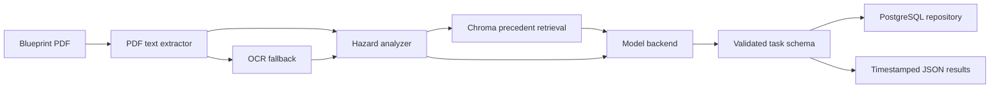

# Cons.trukt - Construction Intelligence OS

[](https://siddhantdamre.github.io/Cons.trukt/)
[](https://github.com/Siddhantdamre/Siddhantdamre/blob/main/PORTFOLIO.md)
[](LICENSE)

Cons.trukt is a construction decision-support project with two connected surfaces:

- the [live trench pre-plan](https://siddhantdamre.github.io/Cons.trukt/), a zero-key browser tool for OSHA soil-condition downgrades, protective-system planning geometry, entry hold points, official citations, and printable field records
- a typed Python document-intelligence pipeline for PDF extraction, OCR fallback, hazard analysis, regulatory retrieval, structured task generation, and optional PostgreSQL persistence

The repository has been hardened from a flat-script prototype into a modular Python package. Legacy script names are still present as compatibility wrappers, but production logic now lives under `src/cons_trukt/` with typed configuration, batch ingestion, structured logging, and testable adapters.

## Recruiter Quick Look

| What to check | Why it matters |
| --- | --- |
| [Live trench pre-plan](https://siddhantdamre.github.io/Cons.trukt/) | Runs immediately in the browser and produces a printable, clause-cited field worksheet. |
| `src/cons_trukt/pipeline/runner.py` | Shows orchestration instead of one-off script execution. |
| `src/cons_trukt/processing/` and `src/cons_trukt/vision/` | Separates OCR and topographical risk logic. |
| `src/cons_trukt/intent.py` and `safety.py` | Rejects non-hazard commands before severity classification. |
| `src/cons_trukt/retrieval/` | Chroma retrieval plus a fitted, serializable offline TF-IDF index. |
| `tests/` | Lets reviewers validate behavior without local Chroma, Ollama, OCR, or Postgres services. |
| `benchmarks/hazard_v2/` | Authoritative edge cases, selective prediction, and OOD rejection. |
| `benchmarks/retrieval_v2/` | Official OSHA/FEMA/EPA/ADA sources plus abstention tests. |

## Problem

Construction teams often make decisions from disconnected PDFs, scans, spreadsheets, permit records, and project-management updates. Cons.trukt explores how to turn that fragmented input into a decision-support workflow that is easier to inspect, test, and review.

For direct field use, the public app intentionally narrows that broad problem to
one high-consequence task: planning cave-in protection before a trench is
entered. It applies the federal OSHA Subpart P tables conservatively, requires
competent-person confirmation, treats freely seeping water as Type C, keeps the
under-5-ft exception conditional, and places excavations deeper than 20 ft on an
RPE-design hold. The calculator is not a soil classifier or shoring design.

## Core Workflow

The production pipeline is centered around `src/cons_trukt/pipeline/runner.py` and the CLI:

1. `PDFTextExtractor`
   Reads text from a PDF with `pdfplumber`; if the PDF has no text layer, it uses `pdf2image` and `pytesseract` for OCR.

2. `HazardAnalyzer`
   Detects site conditions such as steep slopes, contour/topographical signals, water buffers, wetlands, and drainage hazards.

3. Precedent retrieval
   `ChromaPrecedentStore` supports the production memory path. The
   dependency-free `TfidfPrecedentStore` provides a fitted, serializable
   offline path for tests, demos, and benchmark evaluation.

4. `OllamaTaskBackend`
   Prompts an Ollama-served local model (`llama3.2`) for a strict JSON task list. Gemini remains an optional backend when explicitly configured.

5. `PostgresTaskRepository` and result export
   Persists generated tasks when `CONS_TRUKT_DB_URL` is configured and always exports timestamped JSON results.

## Architecture



## Repository Structure

```text
.
|-- README.md
|-- pyproject.toml
|-- config/
|   `-- default.yaml
|-- src/
|   `-- cons_trukt/
|       |-- cli.py
|       |-- config.py
|       |-- audit.py
|       |-- processing/
|       |-- vision/
|       |-- retrieval/
|       |-- models/
|       |-- pipeline/
|       |-- storage/
|       `-- utils/
|-- tests/
|-- main.py
|-- train_all_data.py
|-- query_os.py
|-- validate_accuracy.py
|-- training_data/
`-- c_os_memory/
```

## Dependencies

The repository ships with a `pyproject.toml` that separates production dependencies from optional Gemini and development tooling.

```bash
pip install -e .
pip install -e ".[dev]"
pip install -e ".[gemini]"  # optional
```

External runtime tools and services:

- Ollama
- Tesseract OCR
- Poppler
- PostgreSQL, only if persistence/audits are required
- Git LFS for large datasets and binary artifacts

Pull the local model:

```bash
ollama pull llama3.2
```

If cloning fresh, pull large assets:

```bash
git lfs install
git lfs pull
```

## Configuration

Runtime behavior is controlled by `config/default.yaml` plus environment overrides:

- `CONS_TRUKT_DB_URL` for PostgreSQL persistence and audits
- `CONS_TRUKT_CHROMA_PATH` for Chroma memory location
- `CONS_TRUKT_OLLAMA_MODEL` for local model selection
- `CONS_TRUKT_BACKEND` for backend selection (`ollama` or `gemini`)
- `CONS_TRUKT_POPPLER_PATH` and `CONS_TRUKT_TESSERACT_CMD` for local OCR tools
- `GOOGLE_API_KEY` only when the optional Gemini backend is explicitly selected

## How To Run

Generate synthetic seed data:

```bash
python -m cons_trukt generate-seed-data --config config/default.yaml --output-dir training_data/generated
```

Build or refresh Chroma memory:

```bash
python -m cons_trukt ingest --config config/default.yaml --data-dir training_data
```

Query historical memory:

```bash
python -m cons_trukt query --config config/default.yaml "common reasons for plan review rejection on steep slopes"
```

Run the blueprint pipeline:

```bash
python -m cons_trukt run --config config/default.yaml --input plan.pdf
```

Validate recent task output:

```bash
python -m cons_trukt audit --config config/default.yaml
```

Train and evaluate the offline hazard baseline:

```bash
python scripts/build_v2_benchmarks.py
python -m cons_trukt train-hazard-model \
  --dataset benchmarks/hazard_v2/train.jsonl \
  --output artifacts/hazard_nb_v2.json
python -m cons_trukt validate-hazards
python -m cons_trukt assess-hazard \
  "An eight-foot trench in unstable soil lacks a protective system."
```

Fit, evaluate, and query the offline precedent index:

```bash
python -m cons_trukt fit-precedent-index \
  --corpus benchmarks/retrieval_v2/corpus.jsonl \
  --output artifacts/precedent_tfidf_v2.json
python -m cons_trukt evaluate-retrieval \
  --queries benchmarks/retrieval_v2/queries.jsonl \
  --model artifacts/precedent_tfidf_v2.json \
  --output results/retrieval_v2/evaluation.json
python -m cons_trukt query-offline \
  "ladder egress in a trench four feet deep" \
  --model artifacts/precedent_tfidf_v2.json
```

Run tests:

```bash
make verify
```

Equivalent commands are `python -m ruff check src scripts tests`,
`python -m mypy src`, and `python -m pytest -q`. Run `make evaluate` to
regenerate the v2 retrieval and hard-OOD hazard reports.

## Hazard Benchmark v2

Version 2 combines the original slope/water cases with OSHA excavation
protection and egress, FEMA floodplain elevation review, EPA construction
stormwater controls, ADA ramp screening, threshold distractors, and 12
unrelated requests. The production-facing predictor can accept or escalate;
it does not force every input into `Low`, `Medium`, or `High`.

| Metric | Score |
| --- | ---: |
| Accuracy on accepted cases | 1.000 |
| In-domain coverage | 0.889 |
| High-risk detection | 1.000 |
| Unsafe High-to-Low rate | 0.000 |
| Out-of-domain rejection | 1.000 |

Four of 36 in-domain cases were escalated because confidence did not clear the
acceptance threshold. That is intentional: selective accuracy is safer than
claiming universal coverage. See `docs/evaluation/hazard_v2.md`.

## Regulatory Retrieval Benchmark v2

The v2 index contains nine frozen source summaries derived from official OSHA,
FEMA, EPA, and U.S. Department of Justice pages. Its 15-query suite includes
paraphrases, neighboring-rule distractors, and four unrelated questions.

| Metric | Score |
| --- | ---: |
| Recall@1 | 1.000 |
| Recall@3 | 1.000 |
| Accuracy when accepted | 1.000 |
| Out-of-domain rejection | 1.000 |
| False acceptance | 0.000 |

These are regression results on a compact curated corpus, not proof that the
system covers every jurisdiction or current code edition.

## Hazard Benchmark v1

The repository includes a compact synthetic benchmark for three-way site-risk
classification (`Low`, `Medium`, `High`). The split contains 36 training
examples and 18 frozen held-out examples covering numeric slope thresholds,
instability language, water-only constraints, negation, and out-of-scope notes.

| System | Held-out accuracy | Macro F1 | Errors |
| --- | ---: | ---: | ---: |
| Deterministic rules | 1.000 | 1.000 | 0 / 18 |
| Trained Naive Bayes baseline | 0.778 | 0.763 | 4 / 18 |
| Conservative hybrid | 1.000 | 1.000 | 0 / 18 |

These results are regression evidence on a small synthetic dataset, not a claim
of field-ready geotechnical accuracy. The full protocol and failure analysis are
in `docs/evaluation/hazard_v1.md`.

## Precedent Retrieval Benchmark v1

The offline retrieval benchmark contains 12 synthetic construction-guidance
documents and 13 paraphrased queries. It includes a regression case that maps
domain variants such as `steep hillside` to `slope` rather than over-ranking
generic documents that merely contain `review` or `construction`.

| Metric | Score |
| --- | ---: |
| Recall@1 | 1.000 |
| Recall@3 | 1.000 |
| Mean reciprocal rank | 1.000 |

The score demonstrates deterministic ranking on a compact synthetic fixture,
not semantic search quality on real permit archives.

## Current Demo State

The GitHub Pages surface gives a recruiter-friendly product overview. The local package is now structured so reviewers can inspect package boundaries, run unit tests, and see how OCR, retrieval, LLM reasoning, and persistence are separated.

## Known Gaps

- Full pipeline execution still requires local runtime dependencies and services.
- There is no lockfile or Docker Compose path yet.
- The v2 benchmark is curated from public requirements but is not yet
  independently labeled by licensed engineers or code officials.
- Regulatory coverage is federal and narrow; state, local, and project-specific
  requirements must be added before deployment.
- The lexical precedent benchmark is small and does not replace dense retrieval,
  reranking, source freshness checks, or jurisdiction filters.
- Real construction, permitting, geotechnical, and environmental decisions require qualified human review.

## Roadmap

- Add sample fixtures under `examples/`.
- Add a Docker Compose path for one-command local review.
- Add richer OCR/vision regression tests.
- Expand Hazard Benchmark v1 with expert-reviewed, de-identified plan excerpts.
- Compare the offline lexical index with dense and hybrid retrieval on de-identified records.
- Add screenshots or a hosted interactive demo with safe synthetic data.

## License

MIT

## Disclaimer

This is a decision-support prototype, not a replacement for licensed engineering review.
