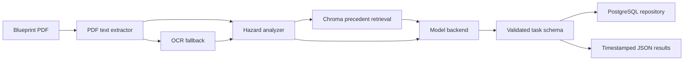

# Cons.trukt - Construction Intelligence OS

[](https://siddhantdamre.github.io/Cons.trukt/)
[](https://github.com/Siddhantdamre/Siddhantdamre/blob/main/PORTFOLIO.md)
[](LICENSE)

Cons.trukt is an experimental Python construction-intelligence prototype. It combines PDF blueprint extraction, OCR fallback, rule-based ground-risk analysis, local retrieval over permit history, LLM task generation, and optional PostgreSQL persistence to turn unstructured construction documents into a task ledger.

The repository has been hardened from a flat-script prototype into a modular Python package. Legacy script names are still present as compatibility wrappers, but production logic now lives under `src/cons_trukt/` with typed configuration, batch ingestion, structured logging, and testable adapters.

## Recruiter Quick Look

| What to check | Why it matters |
| --- | --- |
| [Live surface](https://siddhantdamre.github.io/Cons.trukt/) | Gives a fast product overview and demo direction. |
| `src/cons_trukt/pipeline/runner.py` | Shows orchestration instead of one-off script execution. |
| `src/cons_trukt/processing/` and `src/cons_trukt/vision/` | Separates OCR and topographical risk logic. |
| `src/cons_trukt/retrieval/` and `src/cons_trukt/models/` | Decouples precedent retrieval from prompt/model backends. |
| `tests/` | Lets reviewers validate behavior without local Chroma, Ollama, OCR, or Postgres services. |

## Problem

Construction teams often make decisions from disconnected PDFs, scans, spreadsheets, permit records, and project-management updates. Cons.trukt explores how to turn that fragmented input into a decision-support workflow that is easier to inspect, test, and review.

## Core Workflow

The production pipeline is centered around `src/cons_trukt/pipeline/runner.py` and the CLI:

1. `PDFTextExtractor`
   Reads text from a PDF with `pdfplumber`; if the PDF has no text layer, it uses `pdf2image` and `pytesseract` for OCR.

2. `HazardAnalyzer`
   Detects site conditions such as steep slopes, contour/topographical signals, water buffers, wetlands, and drainage hazards.

3. `ChromaPrecedentStore`
   Queries the Chroma collection `ground_knowledge` and returns historical permit precedents.

4. `OllamaTaskBackend`
   Prompts an Ollama-served local model (`llama3.2`) for a strict JSON task list. Gemini remains an optional backend when explicitly configured.

5. `PostgresTaskRepository` and result export
   Persists generated tasks when `CONS_TRUKT_DB_URL` is configured and always exports timestamped JSON results.

## Architecture



## Repository Structure

```text
.
|-- README.md
|-- pyproject.toml
|-- config/
|   `-- default.yaml
|-- src/
|   `-- cons_trukt/
|       |-- cli.py
|       |-- config.py
|       |-- audit.py
|       |-- processing/
|       |-- vision/
|       |-- retrieval/
|       |-- models/
|       |-- pipeline/
|       |-- storage/
|       `-- utils/
|-- tests/
|-- main.py
|-- train_all_data.py
|-- query_os.py
|-- validate_accuracy.py
|-- training_data/
`-- c_os_memory/
```

## Dependencies

The repository ships with a `pyproject.toml` that separates production dependencies from optional Gemini and development tooling.

```bash
pip install -e .
pip install -e ".[dev]"
pip install -e ".[gemini]"  # optional
```

External runtime tools and services:

- Ollama
- Tesseract OCR
- Poppler
- PostgreSQL, only if persistence/audits are required
- Git LFS for large datasets and binary artifacts

Pull the local model:

```bash
ollama pull llama3.2
```

If cloning fresh, pull large assets:

```bash
git lfs install
git lfs pull
```

## Configuration

Runtime behavior is controlled by `config/default.yaml` plus environment overrides:

- `CONS_TRUKT_DB_URL` for PostgreSQL persistence and audits
- `CONS_TRUKT_CHROMA_PATH` for Chroma memory location
- `CONS_TRUKT_OLLAMA_MODEL` for local model selection
- `CONS_TRUKT_BACKEND` for backend selection (`ollama` or `gemini`)
- `CONS_TRUKT_POPPLER_PATH` and `CONS_TRUKT_TESSERACT_CMD` for local OCR tools
- `GOOGLE_API_KEY` only when the optional Gemini backend is explicitly selected

## How To Run

Generate synthetic seed data:

```bash
python -m cons_trukt generate-seed-data --config config/default.yaml --output-dir training_data/generated
```

Build or refresh Chroma memory:

```bash
python -m cons_trukt ingest --config config/default.yaml --data-dir training_data
```

Query historical memory:

```bash
python -m cons_trukt query --config config/default.yaml "common reasons for plan review rejection on steep slopes"
```

Run the blueprint pipeline:

```bash
python -m cons_trukt run --config config/default.yaml --input plan.pdf
```

Validate recent task output:

```bash
python -m cons_trukt audit --config config/default.yaml
```

Run tests:

```bash
python -m pytest
```

## Current Demo State

The GitHub Pages surface gives a recruiter-friendly product overview. The local package is now structured so reviewers can inspect package boundaries, run unit tests, and see how OCR, retrieval, LLM reasoning, and persistence are separated.

## Known Gaps

- Full pipeline execution still requires local runtime dependencies and services.
- There is no CI workflow yet.
- There is no lockfile or Docker Compose path yet.
- Real construction, permitting, geotechnical, and environmental decisions require qualified human review.

## Roadmap

- Add CI for `pytest`, `ruff`, and `mypy`.
- Add sample fixtures under `examples/`.
- Add a Docker Compose path for one-command local review.
- Add richer OCR/vision regression tests.
- Add screenshots or a hosted interactive demo with safe synthetic data.

## License

MIT

## Disclaimer

This is a decision-support prototype, not a replacement for licensed engineering review.
