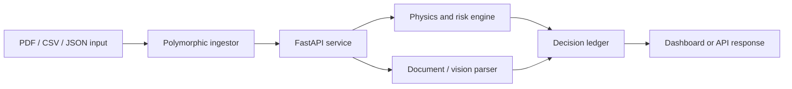

# Cons.trukt - Construction Intelligence OS

[](https://siddhantdamre.github.io/Cons.trukt/)
[](https://github.com/Siddhantdamre/Siddhantdamre/blob/main/PORTFOLIO.md)
[](LICENSE)

Cons.trukt is a construction AI prototype for converting messy project inputs into structured engineering, risk, carbon, and audit outputs. It is framed as a construction operating layer: ingest site documents, interpret risk signals, produce a traceable decision record, and expose results through an API or dashboard.

## Recruiter Quick Look

| What to check | Why it matters |
| --- | --- |
| [Live surface](https://siddhantdamre.github.io/Cons.trukt/) | Fast overview of the product concept and demo direction. |
| FastAPI API path | Shows backend/API thinking rather than only notebook work. |
| Geotechnical logic | Demonstrates domain-specific reasoning beyond generic LLM wrapping. |
| Immutable ledger idea | Shows auditability and responsible AI/product thinking. |

## Problem

Construction teams often make decisions from disconnected PDFs, borehole logs, scans, spreadsheets, and project-management updates. Cons.trukt explores how to turn that fragmented input into a decision-support workflow that is faster, more traceable, and easier to review.

## Core Capabilities

- Document and site-data ingestion for construction workflows.
- Geotechnical calculations and risk flagging for foundation decisions.
- Computer-vision style processing for blueprint or scan-derived signals.
- Carbon and waste tracking for sustainability-aware project reporting.
- Hash-backed ledger records for audit trails and dispute review.
- API-first design so the intelligence layer can plug into dashboards or ERP tools.

## Architecture



## Example API Shape

```bash
curl -X POST "http://localhost:8000/api/v1/ingest" \
  -H "accept: application/json" \
  -H "Content-Type: multipart/form-data" \
  -F "file=@site_borehole_log.csv"
```

Example output:

```json
{
  "status": "SUCCESS",
  "processing_time": "0.0412s",
  "ledger_hash": "38cb3aeb3d91069bff1563f1033151c2caedbe4dea...",
  "payload": {
    "type": "GEOTECH_ANALYSIS",
    "recommendation": "DEEP_VIBRO_COMPACTION",
    "risk_level": "HIGH"
  }
}
```

## Run Locally

```bash
pip install -r requirements.txt
uvicorn main:app --host 0.0.0.0 --port 8000
```

If the dashboard module is available:

```bash
streamlit run dashboard.py
```

## Current Demo State

The GitHub Pages surface gives a recruiter-friendly overview. The next strong demo is a Streamlit app with bundled sample blueprint and borehole files so reviewers can upload a fixture and see the generated risk ledger.

## Roadmap

- Add sample construction fixtures under `examples/`.
- Add screenshots of API docs and dashboard output.
- Add a Docker Compose path for one-command local review.
- Add a hosted Streamlit demo with safe synthetic construction data.

## Disclaimer

This is a decision-support prototype, not a replacement for licensed engineering review.

## License

MIT
